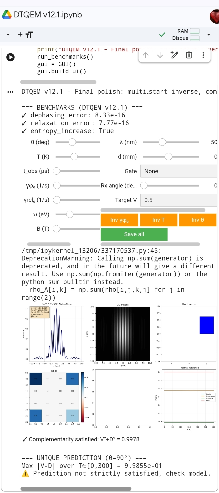

[](https://doi.org/10.5281/zenodo.20039345)

# DTQEM v12.1 - Dual-Time Quantum Entanglement Model
**Official Academic Archive:** [https://zenodo.org/records/20039345](https://zenodo.org/records/20039345)


markdown



# DTQEM-v12.1-Dual-Time-Quantum-Entanglement-Model-Calibrated-Open-Quantum-Simulation
DTQEM v12.1: open‑source two‑qubit entanglement simulator with thermal decoherence, magnetic field, quantum gates. Solves Lindblad exactly, offers inverse calibration from visibility, predicts V = D at θ=90°. Interactive GUI (desktop/mobile).
# DTQEM v12.1 – Dual‑Time Quantum Entanglement Model

**Dual‑Time Quantum Entanglement Model**  
*Open‑source, calibrated, high‑precision simulation of entangled two‑qubit systems under decoherence, magnetic fields, and quantum gates.*

[](https://opensource.org/licenses/MIT)
[](https://www.python.org/)
[](https://github.com/psf/black)

---

## Overview

DTQEM (Dual‑Time Quantum Entanglement Model) provides an **exact, numerically stable** simulation of two‑qubit entanglement in realistic environments. The model solves the Lindblad master equation using **Liouvillian superoperator exponentiation** (no ODE drift) and offers:

- **Thermal decoherence** with Bose–Einstein statistics.
- **Magnetic field** coupling (Zeeman effect).
- **All standard entanglement/coherence metrics**: visibility, concurrence, negativity, purity, entropy, fidelity, l1‑norm coherence.
- **Quantum gates**: Hadamard, CNOT, Rx (rotation around x‑axis).
- **Interactive GUI** (ipywidgets) – responsive on both desktop and mobile.
- **Inverse calibration**: from target visibility to decoherence rate, temperature, or launch angle.
- **Unique testable prediction**: at θ = 90°, visibility equals distinguishability for any temperature.

---

## Key Features

| Feature | Description |
|---------|-------------|
| **Exact dynamics** | `expm(L·t)` for the Liouvillian superoperator – machine‑precision accuracy. |
| **Dimensions** | Two qubits (4×4 density matrix). |
| **Metrics** | V, D, C, N, Pur, S, F_Bell, l1‑coherence. |
| **Inverse calibration** | `Inv γφ₀`, `Inv T`, `Inv θ` – find hidden parameters from experimental visibility. |
| **Visualisation** | 1D/2D double‑slit fringes, Bloch vector, real part of density matrix, thermal response curves. |
| **Benchmarks** | Passes pure dephasing (error < 1e‑12), relaxation, and entropy increase. |

---

## Installation

### Requirements
- Python 3.8+
- numpy, scipy, matplotlib, ipywidgets

### Clone and run

```bash
git clone https://github.com/your-username/DTQEM-v12.1.git
cd DTQEM-v12.1
pip install -r requirements.txt
python dtqem_v12_1.py
